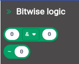

# Bitwise Logic operators

These are useful when you are using an external device which has, for example, 8-bit status and control bytes.

You might need to set some bits and mask other bits. These operations can be done using MakeCode math operators, but they can be confusing!

So try using bitwise operators instead. Each of the operators maps directly to a JavaScript operator, with the same symbol.

## Operators
Two "reporter" blocks are provided - one has 2 arguments (parameters) and a drop-down to select the operator. The only one that doesn't is the **bitwise not**.

